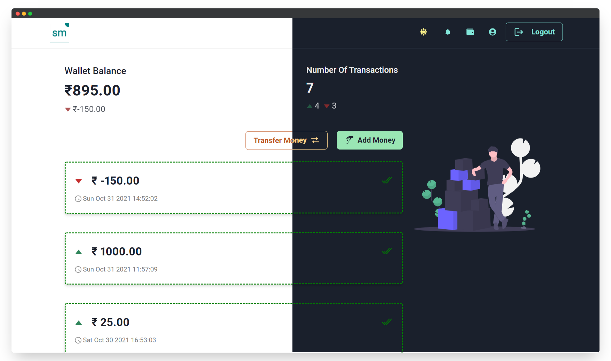

# Smallet

<p align="center">
    
</p>

A nice little mini-digital wallet for everyone.

Its not a real wallet, just meant to be a prototype for people to look at and understand how a digital wallet works.

### Tech Stack

- React
- Next.js
- Chakra UI
- Razorpay for payments
- Vercel for hosting and Serverless Functions
- Firebase for database, authentication and file storage.

### Setup

- Clone the repo
- `cd smallet`
- `npm install or yarn`
- Create a Firebase project, enable Firestore and Firebase Authentication along with Firebase Storage.
- Set the `.env` file to the following format:

```env
NEXT_PUBLIC_FIREBASE_CONFIG=
NEXT_PUBLIC_RAZORPAY_KEY_ID=
RAZORPAY_KEY_SECRET=
FIREBASE_SERVICE_ACCOUNT=
```

For `FIREBASE_SERVICE_ACCOUNT` use [this tutorial](https://dev.to/vvo/how-to-add-firebase-service-account-json-files-to-vercel-ph5).

<p align="center">
    
</p>

### Feedback

The project is open to feedback, any worthwhile improvements will be merged.
