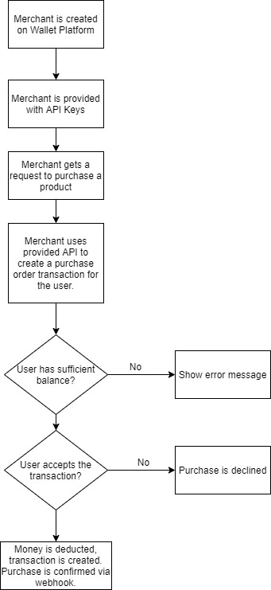

# Smallet

A nice little mini-digital wallet for everyone.

Its not a real wallet, just meant to be a prototype for people to look at and understand how a digital wallet works.

### Tech Stack

- React
- Next.js
- Chakra UI
- Razorpay for payments
- Vercel for hosting and Serverless Functions
- Firebase for database, authentication and file storage.

### Setup

- Clone the repo
- `cd smallet`
- `npm install or yarn`
- Create a Firebase project, enable Firestore and Firebase Authentication along with Firebase Storage.
- Set the `.env` file to the following format:

```env
NEXT_PUBLIC_FIREBASE_CONFIG=
NEXT_PUBLIC_RAZORPAY_KEY_ID=
RAZORPAY_KEY_SECRET=
FIREBASE_SERVICE_ACCOUNT=
```

For `FIREBASE_SERVICE_ACCOUNT` use [this tutorial](https://dev.to/vvo/how-to-add-firebase-service-account-json-files-to-vercel-ph5).

### Feedback

The project is open to feedback, any worthwhile improvements will be merged.

### Upcoming Purhcase Flow for Merchants using this Wallet



For a snippet of the process:

- Create a merchant using the Admin SDK from the backend. Assign an API Key and API Secret for them:

```typescript
// merchants/{merchantId}
{
    "merchant_name": "Merchant XYZ",
    "createdAt": Timestamp,
    "updatedAt": Timestamp,
    "apiKey": "hash of api key",
    "apiSecret": "hash of api key secret",
    "nTransactions": Number,
    "webhook": "URL of webhook to hit on success and failure of payment"
    // ...more fields
}
```

- Provide the merchant an API Route to create a purchase order:

```bash
curl -XPOST -H
'Authorization: <apiKey>-<apiKeySecret>' -H "Content-type: application/json" -d '
    {
        "itemDetails": {
            "name": "Shoes",
            "price": 1556,
            "id": "184e3618-3ae1-11ec-8d3d-0242ac130003"
        },
        "amount": 1556,
        "quantity": 1
    }
}' '/api/merchants/createPurchaseOrder'
```

- The merchant integrates the wallet as a payment method on their site, the user clicks on the payment method and the following process happens.

- Create a purchase order in the backend, show the user the screen to approve the purchase. Once the user approves the purchase, create a deduction transaction and hit the webhook with `payment.successful` response, transfer the amount to the merchant's bank account in the settlement period. This transaction id can be sent to the merchant for refunds and returns later on.

- If the user declines, create a failed transaction in the database and hit the associated webhook with a `payment.failed` response.
